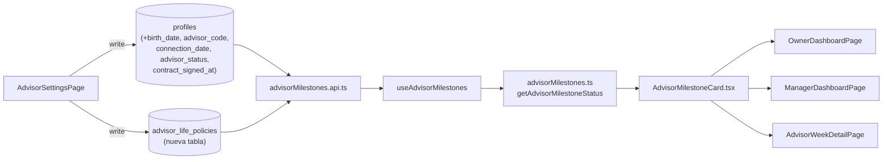

# Hitos y countdown para asesores

## Arquitectura en capas

- Dominio puro: [src/modules/advisors/domain/advisorMilestones.ts](src/modules/advisors/domain/advisorMilestones.ts) — calcula estados/countdowns sin tocar red ni UI.
- Data: [src/modules/advisors/data/advisorMilestones.api.ts](src/modules/advisors/data/advisorMilestones.api.ts) — supabase queries a `profiles` y `advisor_life_policies`.
- Hook: [src/modules/advisors/hooks/useAdvisorMilestones.ts](src/modules/advisors/hooks/useAdvisorMilestones.ts) — patrón `useState/useEffect/useCallback` (consistente con `useTeamOkrDashboard`, sin React Query).
- UI: [src/modules/advisors/ui/AdvisorMilestoneCard.tsx](src/modules/advisors/ui/AdvisorMilestoneCard.tsx).

## 1. Migración SQL (única, reversible)

Archivo nuevo: `supabase/migrations/20260421120000_advisor_milestones.sql`.

Columnas en `public.profiles` (todas nullable, sin backfill, se llenan desde settings):

- `birth_date date`
- `advisor_code text` (con `UNIQUE` parcial donde no sea null)
- `connection_date date`
- `advisor_status text CHECK (advisor_status in ('asesor_12_meses','nueva_generacion','consolidado'))`
- `contract_signed_at timestamptz`

Tabla nueva `public.advisor_life_policies`:

- `id uuid PK default gen_random_uuid()`
- `advisor_user_id uuid NOT NULL REFERENCES profiles(user_id) ON DELETE CASCADE`
- `paid_at date NOT NULL`
- `policy_number text NULL`
- `notes text NULL`
- `created_by uuid REFERENCES auth.users(id)`, `created_at`, `updated_at`
- Índice `(advisor_user_id, paid_at)`
- RLS on.

RLS (reutilizando helpers existentes `is_owner()`, `is_director()`, `is_seguimiento()`, `auth_role()`):

- SELECT: `advisor_user_id = auth.uid()` OR `is_owner()` OR `is_director()` OR `is_seguimiento()` OR (manager/recruiter del asesor).
- INSERT/UPDATE/DELETE: `is_owner() OR is_director() OR is_seguimiento() OR auth_role() = 'developer'`.

Trigger `profiles_block_sensitive_updates` — auditar qué columnas considera sensibles y extender whitelist si bloquea las nuevas (leer `/Users/danielcorres/Projects/vant-os/supabase/migrations/20260116013146_roles_director_observer_and_owner_director_assignments.sql` antes de escribir la migración).

No se modifica ninguna policy existente en `profiles`: la policy `profiles_update_owner_director_all` ya cubre UPDATE por owner/director sobre las nuevas columnas. Agregar una policy similar `profiles_update_seguimiento_developer_milestones` acotada a las 5 columnas nuevas vía trigger `profiles_block_sensitive_updates` (o relajar whitelist).

RPC opcional `get_advisor_life_policy_count(p_advisor uuid, p_from date, p_to date)` — simple `COUNT(*) WHERE paid_at >= p_from AND paid_at < p_to`. Permite conteo eficiente y RLS-safe.

## 2. Dominio: `advisorMilestones.ts`

```typescript
export type AdvisorStatus = 'asesor_12_meses' | 'nueva_generacion' | 'consolidado'
export type MilestoneState = 'not_started' | 'in_progress' | 'at_risk' | 'overdue' | 'completed'

export interface AdvisorMilestoneInput {
  advisor_status: AdvisorStatus | null
  connection_date: string | null       // YYYY-MM-DD
  contract_signed_at: string | null    // ISO
  life_policies_paid_in_phase2: number // inyectado por data layer
}

export interface PhaseStatus {
  state: MilestoneState
  start: Date | null
  deadline: Date | null
  days_remaining: number | null
  days_overdue: number | null
}

export interface AdvisorMilestoneStatus {
  applies: boolean                     // false si !== 'asesor_12_meses'
  phase1: PhaseStatus                  // firma contrato
  phase2: PhaseStatus & { progress_ratio: number; policies_count: number; policies_target: 12 }
  current_phase: 1 | 2 | 'done'
}

export function getAdvisorMilestoneStatus(input, now = new Date()): AdvisorMilestoneStatus
```

Reglas (deterministas, testeables):

- `applies = advisor_status === 'asesor_12_meses'`. Si no, devolver estructura vacía `applies: false`.
- Fase 1: start = `connection_date`, deadline = start + 90d. Estados:
  - `not_started` si `connection_date` es null.
  - `completed` si `contract_signed_at` no null.
  - `overdue` si hoy > deadline.
  - `at_risk` si `days_remaining <= 15`.
  - `in_progress` en otro caso.
- Fase 2: start = `contract_signed_at`, deadline = start + 90d. Sólo si Fase 1 = `completed`. Estados:
  - `completed` si `policies_count >= 12`.
  - `overdue` si hoy > deadline y no completed.
  - `at_risk` si `days_remaining <= 15`.
  - `in_progress` en otro caso.
- `progress_ratio = min(policies_count / 12, 1)`.
- Zona horaria: comparar en `America/Monterrey` al pasar a fechas locales (usar utilidad existente en OKR si la hay; de lo contrario `Intl.DateTimeFormat` con timezone).

## 3. Data layer

`advisorMilestones.api.ts`:

- `fetchAdvisorMilestoneProfiles(advisorIds: string[])`: SELECT `profiles` con las 5 columnas nuevas + nombre.
- `fetchLifePolicyCounts(advisorIds: string[], since?: date, until?: date)`: agrega por asesor usando supabase `.from('advisor_life_policies').select('advisor_user_id, paid_at').in('advisor_user_id', advisorIds)` y filtra por asesor con su ventana Fase 2. Alternativa: RPC `get_advisor_life_policy_count` llamada por asesor (más limpia, una llamada por pagina).

`useAdvisorMilestones(advisorIds)`:

- Carga perfiles + pólizas, construye `AdvisorMilestoneStatus` por asesor llamando al dominio.
- Expone `{ data: Map<string, AdvisorMilestoneStatus>, loading, error, reload }`.

## 4. UI: `AdvisorMilestoneCard.tsx`

Usa clase global `.card` (ver `/Users/danielcorres/Projects/vant-os/src/index.css` línea 62-65) para encajar en dashboards existentes.

Contenido:

- Nombre del asesor + chip `advisor_status`.
- Fase actual (1 o 2) con label corto.
- Countdown: `XX días restantes` o `Vencido hace XX días`.
- Barra de progreso (solo Fase 2) reutilizando el patrón de `ManagerDashboardPage` (`div` gris + inner %).
- Semáforo por clase tailwind: neutro (`text-muted`), ámbar (`bg-amber-50 text-amber-700`), rojo (`bg-red-50 text-red-700`), verde (`bg-emerald-50 text-emerald-700`).
- Si `applies === false`: la tarjeta no se renderiza (el padre decide no pasarle la data).

## 5. Integración en dashboards

- [src/pages/owner/OwnerDashboardPage.tsx](src/pages/owner/OwnerDashboardPage.tsx): insertar nueva sección "Hitos de asesores 12 meses" antes de "Perfil del equipo". Grid `md:grid-cols-2 lg:grid-cols-3 gap-3`. Solo muestra asesores con `advisor_status === 'asesor_12_meses'`. Filtra `advisorIds` ya disponibles en el hook `useTeamOkrDashboard`.
- [src/pages/manager/ManagerDashboardPage.tsx](src/pages/manager/ManagerDashboardPage.tsx): misma sección, limitada a su equipo.
- [src/pages/manager/AdvisorWeekDetailPage.tsx](src/pages/manager/AdvisorWeekDetailPage.tsx): un único `AdvisorMilestoneCard` del asesor en curso (si aplica), debajo del header.

No se modifican hooks existentes. No se tocan queries de OKR.

## 6. Vista admin: `AdvisorSettingsPage`

Archivo nuevo: [src/pages/owner/AdvisorSettingsPage.tsx](src/pages/owner/AdvisorSettingsPage.tsx).

- Lista de asesores (reutilizar patrón de `AssignmentsPage`).
- Formulario por asesor: `birth_date`, `advisor_code`, `connection_date`, `advisor_status`, `contract_signed_at`.
- Subsección "Pólizas de vida pagadas": lista compacta de `advisor_life_policies`, botón "Agregar" (formulario mínimo: `paid_at`, `policy_number`, `notes`), y eliminar.
- Ruta en [src/app/routes.tsx](src/app/routes.tsx):
  ```
  { path: 'settings/advisors', element: <RoleGuard allowedRoles={['owner','director','seguimiento','developer']}><AdvisorSettingsPage /></RoleGuard> }
  ```
- Entrada en sidebar [src/app/layout/Sidebar.tsx](src/app/layout/Sidebar.tsx) bajo "Configuración", visible sólo para `owner|director|seguimiento|developer`.

## 7. Supuestos explícitos

- Fase 2 se muestra únicamente para `advisor_status = 'asesor_12_meses'`. Para `nueva_generacion` y `consolidado` se omite (pendiente de definir sus métricas en trabajo futuro).
- `birth_date`, `advisor_code`, `connection_date`, `advisor_status`, `contract_signed_at` se llenan manualmente (NULLABLE), no hay backfill automático.
- `advisor_life_policies` es una tabla nueva, desacoplada de OKR (`policies_paid`) y del pipeline (`leads.paid_at`). Alta manual por owner/director/seguimiento/developer.
- Zona horaria: todos los cálculos de días usan `America/Monterrey`.
- Si `contract_signed_at` es futura/inconsistente (ej. antes de `connection_date`), el dominio lo tolera pero el formulario debe validar.

## 8. Riesgos

- Trigger `profiles_block_sensitive_updates` puede rechazar UPDATE de las nuevas columnas si las considera sensibles; mitigar inspeccionando la función en la migración `20260116013146...` y ajustando su whitelist en la misma migración nueva.
- `developer` y `super_admin` no están en el `CHECK` de `profiles.role`; se usan en `authTypes` y `ADVISOR_AREA_ROLES`. Como los permisos SQL usan `auth_role()` que lee de `profiles.role`, un usuario marcado `developer` en frontend pero con role distinto en DB no podrá editar pólizas. Documentar que `developer` debe tener una fila en `profiles.role` compatible (o ampliar CHECK) — recomendado escalada separada, no incluida en esta migración.
- RPC opcional `get_advisor_life_policy_count` simplifica mucho el cálculo por asesor; si se omite, hay que tener cuidado con N+1 en dashboards grandes.

## Diagrama de flujo


